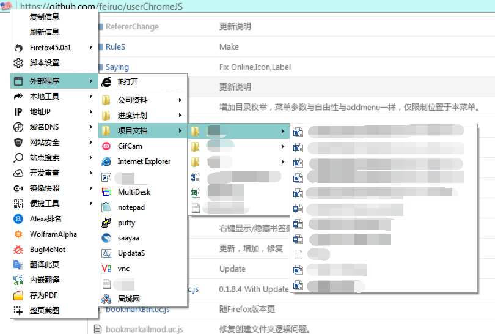
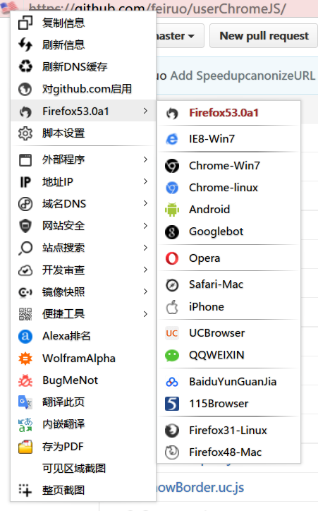

FeiRuoNet.uc.js
============
 - 网络交互信息定义，查看、自定义与网站之间的交互信息。
 - 显示网站IP地址和所在国家国旗，支持IPV6，标示https安全等级，帮助识别网站真实性。
 - 支持本地数据库：`QQWry.dat`(中文)、`Flagfox[ip4.cdb、ip6.cdb]`（**感谢Flagfox**）。
 - 修改浏览器标识(UA)、Cookies、Referer，伪装IP，等所有Http头信息，可破解反盗链,破解限制等。
 - Http头信修改息可完全自定义字段和值，支持自定义规则(正则test)。
 - 刷新DNS缓存。
 - 菜单模式，集成 [AnotherButton](https://github.com/feiruo/userChromeJS/tree/master/anoBtn "AnotherButton") 除自定图标外所有功能。
 - 集成 [showFlagS](https://github.com/feiruo/userChromeJS/tree/master/showFlagS "showFlagS") 所有功能并增强。
 - 左键点击图复制IP，中键刷新，右键弹出菜单。
 - 更多功能需要【_FeiRuoNet.js】、【_FeiRuoNetMenu.js】、【FeiRuoNetLib.js】、【QQWry.dat】、【ip4.cdb】、【ip6.cdb】配置文件。
 - 配置文件位置位于：chrome\lib\ 文件夹下
 
 
 ###注意事项
 
1. 脚本正则方式均为`test()`，`test()`继承正则表达式的`lastIndex`属性，表达式在匹配全局标志g的时候须注意！
1. UA修改暂时无法在E10S实现JSFIX！
1.  配置文件内的规则方式均为正则匹配！
1. 对于菜单配置，本脚本参数增加:  `%IP%`：当域名IP地址  ` %BASEDOMAIN%`：当前域名的主域名；
1.  留空表示不进行该行为。
1. 规则如果是str的会使用 `new RegExp(str,"i")`。
1. 查询优先规则：QQWry -> ip4.cdb(ip6.cdb) -> Web查询源
1. 图标优先规则：本地 -> Base64 -> 网络

------------

######  Version 0.1.0 【2016.10.31 10:30】
1. 增加刷新DNS缓存功能
1. 修复E10S下，监听连接状态导致的浏览器崩溃事件（E10S自动禁用“网络错误时代理”）
1. 菜单部分不再内置，需要[AnotherButton](https://github.com/feiruo/userChromeJS/tree/master/anoBtn "AnotherButton")(1.40up)支持
1. 增加加载状态，优化Tip逻辑，多窗口逻辑，减少资源消耗
1. 优化IP数据库读取缓存机制，国旗和地址使用同源
1. 添加状态提示，自定义图标格式，自定义图标条件
1. 订阅URL，代理协议等更多详细设置请至“`about:config`”页面设置
1. 更多细节优化和修复

------------

###示例部分
####Http头信息修改规则
此处注意，不会覆盖原始请求，这里的只是添加，当原始请求已有是，使用规则内的替换

		var HeadRules = [ //Http Head Rules
			"/^https?://([a-zA-Z]+)\\.?kankan.com.*$/": {
				heads: val,
				heads: val,
			}
		];
		
####自定义查询API,只要是你想要显示的都可以

 		{
 			//是否启用
			Enable: false,
			//是否针对当前网站的不同端口也发送请求
			DifPort: false, 
			//脚本当次运行期间请求次数，0为每次请求。
			Times: 0, 
			//延迟，毫秒 默认1000
			timeout: '1000', 
			//请求的类型，默认 GET；例如：POST、GET、PUT及PROPFIND。大小写不敏感。
			method: 'GET', 
			//查询接口API，此处可用变量参数 %HOST%、%IP%、%URL%等（仅用于GET）具体请参照；https://github.com/ywzhaiqi/userChromeJS/tree/master/addmenuPlus
			Api: "http://whois.pconline.com.cn/", 
			//请求返回类型
			responseType: null, 	
			//用户名		
			bstrUser: null, 
			//密码
			bstrPassword: null, 
			//发送的内容，字符串，仅method为POST时有效
			SendString: null,
			//onreadystatechange
			onreadystatechange: null, 
			//overrideMimeType
			overrideMimeType: null, 
			//回应头,数组,
			getResponseHeader: ['Server', 'Content-Type'], 
			// 请求头，object
			setRequestHeader: { 
				apikey: '1234564556465',
				apikey1: '123456654789',
			},
			//截取函数,传入内容 docum 是XMLHttpRequest()的回应值。
			Func: function(docum) {
				var str
				//Your codes
				return str || null;
			}
		}

------------

