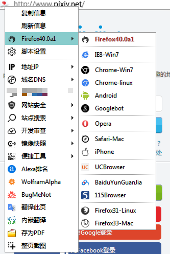
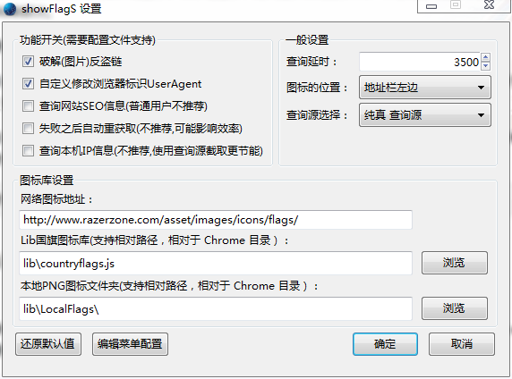
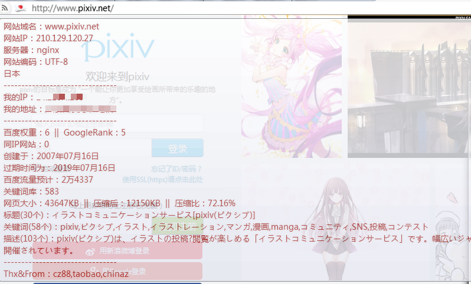

showFlagS
============
 - author：ywzhaiqi、feiruo。
 - 参考 Show Location 扩展、Flagfox 扩展、http://files.cnblogs.com/ziyunfei/showFlag.uc.js 。
 - 显示网站IP地址和国旗，帮助识别网站真实性。
 - 国旗图标左键复制内容，中键刷新，右键弹出菜单。
 - 位置为identity-box时,https,about和chrome页面，隐藏脚本图标，还原identity-box显示。
 - 右键菜单外部配置，配置方式和功能都与anoBtn一样，具体请参考配置文件。
 - 更多的网站详细信息，支持自定义定制，具体可在查看配置文件。
 - 多个查询信息，网站SEO信息，本地信息等，可以于配置文件根据需求和网络情况等自行定制。
 - 只要你想要显示的，都可以根据定制显示出来 show everything what you want。
 - 集成RefererChange，破解反外链连接（全局）。
 - 集成UA切换，支持appVersion和platform修改，支持切换规则。
 - 其他更多自定义设置，请参考配置文件。
 - 模拟提交（感谢FlagFox!!），可以参考FlagFox,本脚本可以按钮class类名识别。

 		(具体使用请参考：http://bbs.kafan.cn/thread-1701286-1-1.html)
 - 本地国旗图标库

 		Chrome\lib\LocalFlags 	
 - 菜单配置文件和本地数据库位置：

		Chrome\lib\_showFlagS.js  \\菜单和脚本配置文件
		Chrome\lib\countryflags.js  \\本地数据库
 - 可以使用本地国旗图标，可以自定义，也可以使用以下样式：
1. FlagFoxFlags24x16 
2. FlagFoxFlags原版
3. WorldIPFlags1 
4. WorldIPFlags2 

说明书：
--------------
 - RefererChange格式：
 		
		@NORMAL：不改变referer
		@FORGE：发送根站点referer
		@ORIGINAL：发送打开站点referer
		@BLOCK : 发送空referer
		"anyURI"
			
 - UA格式：
 		
		{
		label: "IE8-Win7",//Name,用于切换规则和菜单显示
		//浏览器标识字符串 UA
		ua: "Mozilla/5.0 (compatible; MSIE 8.0; Windows NT 6.1; Trident/4.0; GTB7.4; InfoPath.2; SV1; .NET CLR 3.3.69573; WOW64; zh-CN)",

		//是否附加 navigator.appVersion
		appVersion: true, //true 脚本会去掉UA字符串开头的“Mozilla/”，作为navigator.appVersion

		//appVersion项为字符串，脚本会直接以字符串为navigator.appVersion；
		appVersion: "5.0 (Windows NT 6.1; WOW64) AppleWebKit/537.36 (KHTML, like Gecko) Chrome/39.0.2171.99 Safari/537.36",

		//显示的图标
		image: "base64/url"
		}

 - 自带命令函数：【showFlagS.command】形式类型：

		1、是非常简单的POST,如：
		showFlagS.command('Post'（类型声明）, this.tooltipText（提交的URL）, aPostData（提交的数据）); 就这么简单，其他东西一概没有。

		2、通用的GET，默认就是这个了，不用声明类型，最终结果为，新标签打开  url+参数  形式的网页。
		showFlagS.command("网址", "参数1", "参数2", "参数3", "参数4", "参数5"，"参数6")
		网址可以是：tooltipText(编辑项的tooltiptext,方便查看)，可以是查询API或网址；
		网址也可以使用以下参数,参数有（当前网页的）:
		ip：IP地址
		host：域名
		basedomain：主域名；
		url：完整地址；

		3、功能相对比较强大的动作模拟（感谢FlagFox!!），可以参考与FlagFox，本脚本增加识别按钮class类名，使用方法如下：
		showFlagS.command('Action','http://ping.chinaz.com/', 'host', 'IP', null,'but')
		Action：	声明类型，如果要使用模拟提交功能必须先使用Action声明；
		'http://ping.chinaz.com/'： 	目标网址，推荐写在tooltipText，用this.tooltipText代表，方便使用的时候查看；
		host： 	打开目标网页时填写你输入数据位置的ID；
		IP： 	这个是你需要输入的数据，内置IP，host,basedomain,url，具体代表请参考第二条；
		null： 	点击使你输入的数据生效或提交按钮的ID，遇到奇葩网站提交按钮没有ID的话可以填写null，用下面一条解决；
		but: 		点击使你输入的数据生效或提交按钮的类名（class）；

		还有一些其他的，比如编辑文件
		showFlagS.command("Edit", "文件路径，支持相对路径")
		showFlagS.command("Copy", "函数或者字符串")
注意：
--------------

- 文如果使用faviconContextMenu，请在图标外面右键，图标上面右键是本脚本的菜单。
- 如果有特殊需要显示 网站标识(page-proxy-favicon)的，请添加以下样式：

		#page-proxy-favicon{visibility: visible !important;}

图片：
--------------

